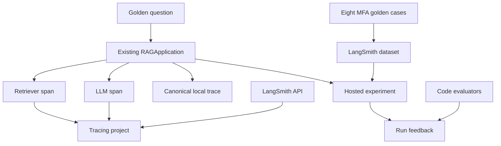

# LangSmith for the existing payroll-MFA RAG

Verified against `langsmith==0.10.17` on 9 August 2026. This layer starts from the
same RAG application, two synthetic policy documents, and eight governed `MFA-*`
golden cases already used by Ragas and DeepEval.

There is no dependency on `day4_core_metrics`, a `D4-*` case, or a frozen-output
replay. The primary session path uses the hosted LangSmith API and UI.

## Session boundary

The previous work established two evaluation implementations:

- Ragas scores RAG-specific semantic relationships through Ragas metrics.
- DeepEval represents each case as an `LLMTestCase` and adds metric thresholds,
  reasons, pass/fail behavior, and G-Eval for the governed policy criterion.

LangSmith adds a different layer around the application:

1. capture nested traces for the real RAG execution;
2. persist governed examples as a dataset;
3. run application variants as experiments;
4. store evaluator outputs as feedback on experiment runs;
5. compare two experiments over the same examples;
6. apply changed evaluators to cached experiment runs;
7. attach human or production feedback to trace IDs.

LangSmith does not make a weak evaluator correct. In this project, the exact
retrieval, concept, policy, and citation calculations are owned by project code;
LangSmith executes and records them.

## Architecture



The base `RAGApplication` remains framework-neutral. It still owns retrieval,
generation, timings, and local JSON persistence. `LangSmithRAGApplication`
subclasses it only to wrap the real `_retrieve()`, `_generate()`, and `ask()`
boundaries with `traceable`.

## LangSmith object model used here

| Object | Meaning in this project |
|---|---|
| Project | Collection of operational traces from the RAG |
| Trace | One end-to-end RAG request |
| Run/span | One unit inside the trace: root chain, retrieval, or generation |
| Dataset | Versioned collection of the eight governed MFA examples |
| Example | Input question plus reference answer and expected evidence contract |
| Experiment | One RAG configuration run over every dataset example |
| Evaluator | Function that scores a target output against reference evidence |
| Feedback | Evaluator or human result attached to a run |
| Comparative experiment | Side-by-side evaluation of two completed experiments |

## Code modules

| Path | Responsibility |
|---|---|
| `langsmith_app.py` | Hosted preflight, trace, dataset, experiment, comparison, re-evaluation, and feedback CLI |
| `langsmith_evaluation/settings.py` | API endpoint, key, workspace, project, dataset, masking, and concurrency |
| `langsmith_evaluation/tracing.py` | Real nested chain, retriever, and LLM spans |
| `langsmith_evaluation/dataset.py` | Maps only `MFA-001` through `MFA-008` into stable LangSmith examples |
| `langsmith_evaluation/evaluators.py` | Transparent retrieval, answer-policy, citation, exact-match, summary, and pairwise evaluators |
| `langsmith_evaluation/runner.py` | Dataset synchronization, live experiments, comparison, and cached-run re-evaluation |
| `langsmith_evaluation/reporting.py` | Local JSON/CSV copy of experiment evidence |
| `tests/test_langsmith_evaluation.py` | Dependency boundary, SDK dry run, hosted API contract, comparison, and trace preservation |

## 1. Install

Use a fresh Python 3.11 or 3.12 environment.

### Windows PowerShell

```powershell
python -m venv .venv
.\.venv\Scripts\Activate.ps1
python -m pip install --upgrade pip
pip install -r requirements-all-eval.txt
Copy-Item .env.example .env
```

### macOS or Linux

```bash
python3 -m venv .venv
source .venv/bin/activate
python -m pip install --upgrade pip
pip install -r requirements-all-eval.txt
cp .env.example .env
```

`requirements-langsmith.txt` installs only the RAG and LangSmith. Use
`requirements-all-eval.txt` when the same environment must also retain the
verified Ragas and DeepEval implementations.

## 2. Create and configure the LangSmith API key

Create a LangSmith account, open **Settings > API Keys**, and create a key.
Use a personal access token for an individual workshop. Use a workspace-scoped
service key for a production workload. Store the value only in `.env` or a
secret manager; never commit it.

For this synthetic workshop corpus, use:

```dotenv
LANGSMITH_API_KEY=replace-locally
LANGSMITH_TRACING=true
LANGSMITH_ENDPOINT=https://api.smith.langchain.com
LANGSMITH_WORKSPACE_ID=
LANGSMITH_PROJECT=payroll-mfa-rag-observability
LANGSMITH_DATASET=payroll-mfa-rag-golden-v1
LANGSMITH_MAX_CONCURRENCY=2
LANGSMITH_CAPTURE_CONTENT=true
```

`LANGSMITH_WORKSPACE_ID` is required when the selected key can access more than
one workspace. Use a regional or self-hosted endpoint only when the LangSmith
deployment requires it.

`LANGSMITH_CAPTURE_CONTENT=true` is appropriate here because the corpus is
synthetic and learners need to inspect the question, evidence, prompt, and
answer. When false, this project configures the client to hide trace inputs and
outputs. That masking does not make dataset synchronization private: the dataset
command still uploads the selected example inputs and reference outputs.

## 3. Authenticate before running a model

```bash
python langsmith_app.py preflight --hosted
```

The command validates:

- the pinned LangSmith SDK;
- all eight golden cases and their chunk IDs;
- the configured endpoint and workspace selection;
- API authentication through a read-only dataset listing;
- the project, dataset, tracing, and content-capture settings.

It does not run the RAG, create a dataset, write a trace, or call a judge model.

## 4. Send the first real trace

Start Ollama and ensure the configured generation and embedding models exist,
or select `--rag-provider openai` with `OPENAI_API_KEY` configured.

```bash
python langsmith_app.py trace-one \
  "I changed phones and cannot complete MFA. How do I regain payroll access?" \
  --rag-provider ollama \
  --top-k 3 \
  --confirm-hosted
```

The command executes the real pipeline and creates this hierarchy:

```text
payroll_mfa_rag                  chain
├── payroll_mfa_retrieve        retriever
└── payroll_mfa_generate        llm
```

The retriever span emits LangSmith's document-shaped output: `page_content`,
`type="Document"`, and metadata containing the chunk ID, document version,
section, and similarity score. The LLM span uses message-shaped inputs plus
provider/model metadata. The CLI flushes the SDK buffer before exit, then prints:

- the canonical local trace ID and JSON path;
- the LangSmith root run ID;
- a direct LangSmith run URL;
- the retrieved chunk IDs;
- whether trace content capture was enabled.

The local trace and hosted trace are related but not the same object. The local
trace remains available even if hosted tracing is later disabled.

## 5. Create the hosted dataset

```bash
python langsmith_app.py sync-dataset --confirm-hosted
```

The dataset contains exactly eight examples from
`evaluation/data/golden_cases.json`. Each example stores:

- `inputs`: `case_id` and question;
- `outputs`: reference answer, mandatory chunk IDs, relevance grades, expected
  citations, required concept groups, and forbidden-claim patterns;
- `metadata`: case ID, tags, dataset version, and source file.

Example IDs are UUID5 values derived from the dataset version and `MFA-*` ID.
Repeating the command upserts those stable examples rather than intentionally
adding duplicates, while a new dataset version can receive new identities.

Changing a source policy, chunk ID, or expected behavior requires a dataset
version decision. Reusing the same version label after a semantic contract
change destroys experiment comparability.

## 6. Evaluators used in the hosted experiment

### Core profile

`required_context_recall`:

```text
required mandatory chunk IDs retrieved / all mandatory chunk IDs
```

`required_concept_coverage`:

```text
required answer-concept groups matched / all required groups
```

`forbidden_claim_pass`:

```text
0 if a governed forbidden regex matches; otherwise 1
```

### Full profile

The full profile also adds:

- `citation_validity`: cited chunk IDs that were actually retrieved;
- `citation_recall`: expected citation IDs present in the answer;
- `exact_reference_match`: strict normalized string equality.

These are deterministic code evaluators. They are not Ragas metrics, DeepEval
metrics, LangSmith LLM-as-a-judge scores, or human labels. LangSmith records the
returned key, score/value, and comment as feedback on the experiment run.

## 7. Run the first hosted experiment

```bash
python langsmith_app.py run \
  --rag-provider ollama \
  --top-k 3 \
  --metric-profile full \
  --hosted \
  --confirm-hosted \
  --experiment-prefix baseline-top3
```

Add `--sync-dataset` to this command only when dataset synchronization has not
already been performed.

For each hosted example, LangSmith passes `example.inputs` to the target. The
target runs the existing RAG and returns the answer, retrieved contexts and IDs,
model identifiers, latencies, and local trace identifiers. The evaluators then
receive the actual output and `example.outputs`, calculate feedback, and attach
that feedback to the experiment run.

The CLI prints the hosted experiment name, ID, URL, case count, feedback means,
and local JSON/CSV report paths. No fixed score is documented here because the
answer is generated live and must be measured rather than invented.

## 8. Run a controlled candidate

Change exactly one intended variable. For example:

```bash
python langsmith_app.py run \
  --rag-provider ollama \
  --top-k 5 \
  --metric-profile full \
  --hosted \
  --confirm-hosted \
  --experiment-prefix candidate-top5
```

Keep the dataset version, corpus, prompt, model, evaluator code, and repetition
count fixed when the intended comparison is only `top_k`. Otherwise the observed
difference is confounded.

For a non-deterministic model, add `--num-repetitions 3`. This creates 24 target
runs for eight examples. Repetition reduces the chance of judging a model variant
from one lucky or unlucky sample, but it increases latency and model cost.

## 9. Create a pairwise comparative experiment

Copy the exact experiment names printed by the two previous commands:

```bash
python langsmith_app.py compare \
  "BASELINE_EXPERIMENT_NAME" \
  "CANDIDATE_EXPERIMENT_NAME" \
  --experiment-prefix top3-vs-top5 \
  --confirm-hosted
```

The command calls LangSmith's comparative `evaluate()` interface over the two
completed experiments. It does not rerun the RAG. Output order is randomized to
avoid a systematic first-position preference.

The supplied pairwise evaluator is deliberately transparent and risk-first:

1. prefer the run that passes the forbidden-claim gate;
2. when both have the same policy result, compare the mean of mandatory-context
   recall, required-concept coverage, and citation recall;
3. record a tie when both vectors are equal.

This is a workshop decision rule, not a universal quality score. Open the
returned comparison URL and inspect the raw answer and retrieved evidence for
every changed row.

## 10. Re-evaluate cached experiment runs

```bash
python langsmith_app.py reevaluate \
  "EXPERIMENT_NAME" \
  --metric-profile full \
  --confirm-hosted
```

This reads the cached target outputs and applies the current evaluator functions.
The RAG is not run again. Use it when evaluator logic changes. Do not use it to
claim how a new retriever, prompt, model, corpus, or `top_k` performs; those
changes require a new target experiment.

## 11. Add reviewed human feedback

```bash
python langsmith_app.py feedback RUN_ID \
  --key human_correctness \
  --score 1 \
  --comment "Approved after reviewing the answer and retrieved evidence" \
  --confirm-hosted
```

The CLI passes `extend_trace_retention=false` unless `--extend-retention` is
explicitly supplied. Record the reviewer, rubric version, and review context in
a production process; a numeric score without provenance is weak evidence.

## 12. Local dry run without a LangSmith key

This is a useful code check, but it is not the main workshop demonstration:

```bash
python langsmith_app.py run \
  --rag-provider ollama \
  --case-id MFA-001 \
  --top-k 3 \
  --metric-profile core
```

The RAG provider is still called. `upload_results=False` prevents the target,
evaluator, and experiment traces from being recorded in LangSmith. The command
writes only the local JSON/CSV report.

## How tracing works internally

1. `LangSmithSettings` loads the API, endpoint, workspace, project, dataset,
   masking, and concurrency settings.
2. `LangSmithRAGApplication` builds traceable wrappers once during construction.
3. Calling `ask()` creates a root `chain` run.
4. The inherited `RAGApplication.ask()` calls the overridden `_retrieve()` and
   `_generate()` methods.
5. Those methods invoke the real base implementations inside `retriever` and
   `llm` child runs.
6. LangSmith uses context propagation to preserve parent-child ordering.
7. The base pipeline writes its canonical local trace.
8. The root wrapper records the LangSmith run ID against that canonical trace ID.
9. Short-lived `trace-one` execution calls `client.flush()` before reading the
   hosted run and printing its URL.

No post-hoc decorative spans are created. If retrieval or generation raises an
exception, the active run records the error while the base provider exception is
still propagated to the CLI.

## Ragas, DeepEval, and LangSmith remain separate

| Dimension | Ragas | DeepEval | LangSmith |
|---|---|---|---|
| Primary role here | RAG semantic metrics | Test-case evaluation, thresholds, reasons, G-Eval | Tracing, datasets, experiments, feedback, comparison, operations |
| Core unit | Metric input/sample | `LLMTestCase` | Trace/run, example, experiment, feedback |
| Metric ownership | Ragas implementation plus judge | DeepEval implementation plus judge | Supplied code/UI evaluator or external judge |
| Online observability | Not used here | Not used here | Core capability |
| Hosted dataset/experiments | Not used here | Not used here | Core capability |
| Result prefix in local reports | `ragas_*` | `deepeval_*` | `langsmith_feedback_*` |
| Scores interchangeable | No | No | No |

LangSmith can record a result produced by an external framework as feedback, but
the origin must remain explicit. Do not relabel a Ragas or DeepEval score as a
native LangSmith metric and do not average unlike score definitions.

## Production controls and limitations

- Hosted tracing and datasets cross a system boundary. Review data classification,
  regional endpoint, access roles, encryption, retention, deletion, and audit needs.
- Input/output masking affects traces created by the client; it does not sanitize
  the dataset payload selected for upload.
- Sampling can miss rare safety failures. Keep deterministic high-risk checks and
  intentional incident sampling.
- The custom Ollama provider does not automatically expose token usage or model
  cost metadata to LangSmith.
- Regex evaluators are reproducible but incomplete for paraphrases. Keep known
  misses visible and version rule changes.
- Exact match is strong for fixed-format contracts and weak for semantic
  paraphrases.
- Aggregate experiment means can hide one severe case. Inspect per-example traces
  and define blocking policies separately.
- Pairwise comparison ranks the two supplied outputs; it does not establish an
  absolute quality floor.
- Online evaluators can affect retention and cost. Configure filters, sampling,
  and backfills deliberately.

## Two-hour teaching sequence

| Minutes | Section | Live evidence |
|---:|---|---|
| 0-15 | Why LangSmith follows Ragas and DeepEval | Separate metric framework from observability/experiment platform |
| 15-30 | Object model and architecture | Map project, trace, run, dataset, example, experiment, evaluator, feedback |
| 30-50 | Hosted API setup and first trace | Open one root chain with retriever and LLM children |
| 50-65 | Dataset synchronization | Inspect `MFA-001` inputs, reference outputs, metadata, and stable ID |
| 65-85 | Baseline hosted experiment | Run eight examples and inspect feedback columns |
| 85-100 | Candidate experiment | Change only `top_k` and preserve the remaining configuration |
| 100-112 | Pairwise comparison | Open the comparison URL and investigate changed rows |
| 112-118 | Re-evaluation and human feedback | Explain cached target outputs versus a new target run |
| 118-120 | Debrief | State what LangSmith proves and what still requires Ragas, DeepEval, and human review |

## Failure diagnosis

| Symptom | Likely cause | Check |
|---|---|---|
| Hosted preflight returns 401/403 | Invalid key, wrong endpoint, workspace scope, or role | API key type, endpoint, and `LANGSMITH_WORKSPACE_ID` |
| `trace-one` says tracing must be true | Tracing is disabled in `.env` | `LANGSMITH_TRACING=true` before process start |
| LangSmith trace exists but content is hidden | Client masking is active | `LANGSMITH_CAPTURE_CONTENT`; enable only for approved synthetic data |
| Dataset sync succeeds but experiment cannot find it | Different workspace, endpoint, or dataset name | Use the same `.env` for both commands |
| Nested spans are absent | Old code path or tracing configuration | Run `trace-one`; inspect root, retriever, and LLM names |
| Experiment has target errors | RAG provider, model availability, index, or timeout failure | Open the failing run and the local provider exception |
| Feedback is blank | Evaluator error or missing reference contract | Open evaluator run/error; do not convert blank to zero |
| Comparison mixes different examples | Experiments do not share a governed dataset version | Rerun against the same dataset and version |

## Official references

- API key and account: https://docs.langchain.com/langsmith/create-account-api-key
- Custom instrumentation: https://docs.langchain.com/langsmith/annotate-code
- Project selection: https://docs.langchain.com/langsmith/log-traces-to-project
- Dataset management: https://docs.langchain.com/langsmith/manage-datasets-programmatically
- Evaluation runner: https://docs.langchain.com/langsmith/evaluate-llm-application
- Local evaluation: https://docs.langchain.com/langsmith/local
- Pairwise evaluation: https://docs.langchain.com/langsmith/evaluate-pairwise
- Re-evaluate existing experiments: https://docs.langchain.com/langsmith/evaluate-existing-experiment
- User feedback: https://docs.langchain.com/langsmith/attach-user-feedback
- Online code evaluators: https://docs.langchain.com/langsmith/online-evaluations-code
- Evaluation concepts: https://docs.langchain.com/langsmith/evaluation-concepts

## Verification boundary

The code has been verified with the pinned SDK through offline tests and a real
local LangSmith SDK evaluation using `upload_results=False`. Hosted commands are
validated against the SDK 0.10.17 interfaces and guarded by explicit confirmation.
A hosted trace or experiment is not claimed until it is executed with the
operator's real `LANGSMITH_API_KEY` and configured RAG provider.
