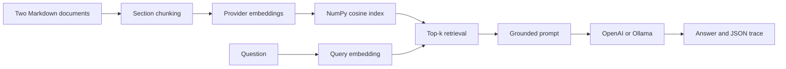

# RAG Project: Payroll MFA Support

A small, real retrieval-augmented generation application for the Aspire workshop. It ingests two synthetic policy documents, creates section-level embeddings, retrieves evidence with cosine similarity, asks either OpenAI or local Ollama to answer from that evidence, and saves the complete run as a reusable trace.

This phase builds the RAG system only. Ragas and DeepEval are deliberately not installed yet; the trace already preserves the evidence they will need in the next phase.

## What runs live



Nothing in `results/` is pre-authored. The retrieved chunks and answer are produced during the run.

## Project structure

```text
RAG_Project/
├── app.py                     # inspect, build, ask, and demo commands
├── documents/
│   ├── SEC-17_payroll_mfa_policy.md
│   └── OPS-09_payroll_support_runbook.md
├── rag/
│   ├── chunking.py            # Markdown -> stable section chunks
│   ├── config.py              # .env-backed settings
│   ├── index.py               # persisted cosine-similarity index
│   ├── models.py              # chunks, retrieval results, canonical trace
│   ├── pipeline.py            # retrieve -> prompt -> generate -> persist
│   └── providers.py           # OpenAI and Ollama adapters
├── storage/                   # generated embedding indexes
├── results/                   # generated RAG traces
└── tests/                     # offline tests; no model or API calls
```

## 1. Install

Python 3.11 or newer is recommended.

### Windows PowerShell

```powershell
python -m venv .venv
.\.venv\Scripts\Activate.ps1
python -m pip install --upgrade pip
pip install -r requirements-dev.txt
Copy-Item .env.example .env
```

### macOS or Linux

```bash
python3 -m venv .venv
source .venv/bin/activate
python -m pip install --upgrade pip
pip install -r requirements-dev.txt
cp .env.example .env
```

## 2A. Run locally with Ollama

Install and start Ollama, then pull one generation model and one embedding model:

```bash
ollama pull gemma3:4b
ollama pull embeddinggemma
```

Keep these values in `.env`:

```dotenv
RAG_PROVIDER=ollama
OLLAMA_BASE_URL=http://localhost:11434
OLLAMA_CHAT_MODEL=gemma3:4b
OLLAMA_EMBEDDING_MODEL=embeddinggemma
```

Run the application:

```bash
python app.py inspect
python app.py build --provider ollama
python app.py ask "I changed phones and cannot complete MFA. How do I regain payroll access?" --provider ollama --top-k 3 --show-context
```

Ollama's local endpoint does not require authentication. `embeddinggemma` requires Ollama 0.11.10 or newer.

## 2B. Run with the OpenAI API

Add your key only to the local `.env` file:

```dotenv
RAG_PROVIDER=openai
OPENAI_API_KEY=replace-with-your-key
OPENAI_CHAT_MODEL=gpt-5.6-luna
OPENAI_EMBEDDING_MODEL=text-embedding-3-small
```

Then run:

```bash
python app.py build --provider openai
python app.py ask "I changed phones and cannot complete MFA. How do I regain payroll access?" --provider openai --top-k 3 --show-context
```

The OpenAI adapter uses `client.embeddings.create(...)` for vectors and `client.responses.create(...)` for generation. Change model names through `.env`; there are no model IDs buried in application logic.

The sample configuration uses `gpt-5.6-luna` because the current OpenAI model guide positions it for cost-sensitive workloads. If that model is not enabled for your project, set `OPENAI_CHAT_MODEL` to a Responses-compatible model available to your account.

## 3. Run all three live questions

```bash
python app.py demo --provider ollama --top-k 3
# or
python app.py demo --provider openai --top-k 3
```

The questions cover phone replacement, a prohibited manager bypass, and required recovery-ticket fields.

## 4. Inspect the generated evidence

Each run creates `results/<run_id>.json` and refreshes `results/latest.json`. The trace contains:

```json
{
  "question": "...",
  "answer": "...",
  "provider": "ollama",
  "embedding_model": "embeddinggemma",
  "generation_model": "gemma3:4b",
  "top_k": 3,
  "retrieved_chunk_ids": ["SEC-17::device-re-enrolment"],
  "retrieved_contexts": ["[SEC-17::device-re-enrolment] ..."],
  "retrieval_scores": [0.81],
  "retrieved_chunks": [],
  "retrieval_latency_ms": 18,
  "generation_latency_ms": 1240
}
```

The example above shows the schema, not a promised score or answer. Actual values come from the selected embedding and generation models.

## 5. Change one thing and observe the system

Run the same question with `--top-k 1` and `--top-k 3`:

```bash
python app.py ask "I changed phones and payroll closes today. What should I do?" --provider ollama --top-k 1
python app.py ask "I changed phones and payroll closes today. What should I do?" --provider ollama --top-k 3
```

Inspect which required sections were missed or which irrelevant sections were added. This becomes the first useful RAG evaluation hypothesis; it is more meaningful than comparing answer prose alone.

## 6. Test without an API key or Ollama

```bash
pytest -q
```

The tests use a deterministic fake provider to verify document parsing, stable chunk IDs, cosine ranking, index persistence, and end-to-end trace creation. They do not claim anything about model quality.

## Design decisions

- **Section-aware chunks:** policy sections remain understandable and citations stay stable. This is better for this small corpus than arbitrary character windows.
- **NumPy index:** retrieval is visible and inspectable. A vector database would add deployment concepts without improving a 15-chunk classroom corpus.
- **Two provider adapters:** application logic does not know whether OpenAI or Ollama produced the vectors and answer.
- **Separate indexes per embedding model:** vectors from different embedding models cannot safely share one index.
- **Canonical trace:** the RAG application runs once; later evaluator adapters consume identical evidence.
- **No orchestration framework:** every stage is explicit. LangChain or LlamaIndex can be introduced after learners understand the underlying contract.

## Current limitations

- Section chunking has no token-aware splitting for very long sections.
- The index is rebuilt manually after document changes.
- Retrieval uses dense cosine similarity only: no keyword search, filters, reranking, or access control.
- The two supplied documents are synthetic and intentionally small.
- Model output can still be wrong, unsupported, incomplete, or poorly cited.
- No metric, threshold, regression dataset, or release gate is included in this phase.

## Next phase: evaluate the same trace

| Canonical trace field | Ragas | DeepEval |
|---|---|---|
| `question` | `user_input` | `input` |
| `answer` | `response` | `actual_output` |
| `retrieved_contexts` | `retrieved_contexts` | `retrieval_context` |
| Later approved reference | `reference` | `expected_output` |
| `retrieved_chunk_ids` | ID-based/custom retrieval metrics | metadata/custom metric |

The next phase will add a small golden-question file with approved references. It will not replace these live traces with pre-generated answers.

## Primary documentation used

- [OpenAI text generation and Responses API](https://developers.openai.com/api/docs/guides/text)
- [OpenAI vector embeddings](https://developers.openai.com/api/docs/guides/embeddings)
- [OpenAI GPT-5.6 Luna model](https://developers.openai.com/api/docs/models/gpt-5.6-luna)
- [OpenAI Python SDK](https://github.com/openai/openai-python)
- [Ollama embeddings](https://docs.ollama.com/capabilities/embeddings)
- [Ollama embed endpoint](https://docs.ollama.com/api/embed)
- [Ollama chat endpoint](https://docs.ollama.com/api/chat)
- [Ollama `embeddinggemma` model](https://ollama.com/library/embeddinggemma)
- [Ollama `gemma3:4b` model](https://ollama.com/library/gemma3%3A4b)
