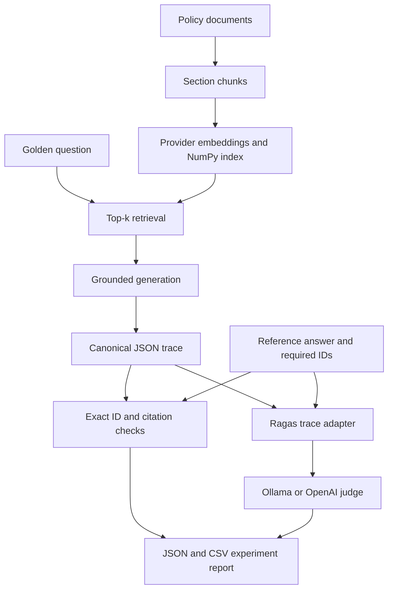

# Payroll MFA RAG and Ragas Evaluation Solution

This project contains two explicit layers:

1. A small retrieval-augmented generation application over two synthetic payroll-MFA documents.
2. A Ragas 0.4.3 evaluation system that consumes the application's real JSON traces.

The evaluator does not rebuild the RAG or substitute pre-generated answers. The RAG retrieves,
generates, cites, and records a trace first. Exact metrics and Ragas score that evidence afterward.

## Architecture



The RAG provider and judge provider are separate settings. Supported combinations are:

- Ollama RAG + Ollama judge
- OpenAI RAG + OpenAI judge
- Ollama RAG + OpenAI judge
- OpenAI RAG + Ollama judge

Using an independent judge is often preferable when model self-evaluation could create correlated errors.

## Project structure

```text
RAG_Project/
├── app.py                         # Build, inspect, ask, and demo the RAG
├── eval_app.py                    # Preflight, run, and saved-trace evaluation CLI
├── documents/                     # Two synthetic source documents
├── rag/                           # Chunking, retrieval, providers, pipeline, trace
├── evaluation/
│   ├── data/golden_cases.json     # Eight human-owned evaluation cases
│   ├── dataset.py                 # Dataset and chunk-ID integrity checks
│   ├── retrieval_metrics.py       # P@k, R@k, F1, Hit, RR, AP, nDCG
│   ├── deterministic_metrics.py   # Citation and policy checks
│   ├── judges.py                  # Ollama/OpenAI Ragas adapters and preflight
│   ├── ragas_runner.py            # Ragas 0.4 collections-based metrics
│   ├── runner.py                  # Live and saved-trace orchestration
│   ├── reporting.py               # Macro/micro summaries, CSV/JSON, gates
│   ├── gates.example.json         # Disabled threshold template
│   └── results/                   # Generated reports
├── docs/build_explainer_pdf.py    # Reproducible ReportLab guide generator
├── tests/                         # Offline application and evaluation tests
├── requirements.txt               # RAG-only dependencies
├── requirements-dev.txt           # RAG tests
├── requirements-eval.txt          # Tested Ragas dependency set
└── requirements-docs.txt          # Optional PDF-generation dependency
```

## 1. Installation

Use Python 3.11 or 3.12. The tested environment is Python 3.12.13.

### Windows PowerShell

```powershell
python -m venv .venv
.\.venv\Scripts\Activate.ps1
python -m pip install --upgrade pip
pip install -r requirements-eval.txt
Copy-Item .env.example .env
```

### macOS or Linux

```bash
python3 -m venv .venv
source .venv/bin/activate
python -m pip install --upgrade pip
pip install -r requirements-eval.txt
cp .env.example .env
```

`requirements-eval.txt` deliberately pins `langchain-community==0.3.31`.
Ragas 0.4.3 unconditionally imports an old VertexAI module that is absent from
`langchain-community` 0.4.x; an unconstrained install can therefore succeed and then fail on
`import ragas`. The pin is verified by the test suite and documented in the upstream issue.

Verify the installation without calling a model:

```bash
python eval_app.py preflight --judge-provider ollama
pytest -q
```

### Why the Ragas judge uses `AsyncOpenAI`

Ragas 0.4 collections metrics expose both `.score()` and `.ascore()`, but the
synchronous `.score()` method runs the metric's asynchronous scoring pipeline.
The metric therefore calls the evaluator through `agenerate()` internally. The
judge bundle must be constructed with `AsyncOpenAI`, including when this CLI is
invoked synchronously.

This applies to both provider routes:

- OpenAI uses `AsyncOpenAI()` against the default OpenAI endpoint.
- Ollama uses `AsyncOpenAI(base_url="http://localhost:11434/v1", api_key="ollama")`
  against Ollama's OpenAI-compatible endpoint.

The modern Ragas embeddings adapter accepts the same asynchronous client and
bridges synchronous embedding calls where a metric requires them.

Rebuild the explainer PDF (optional):

```bash
pip install -r requirements-docs.txt
python docs/build_explainer_pdf.py \
  --output ../output/pdf/RAGAS_Evaluation_Solution_Ollama_OpenAI.pdf
```

## 2. Ollama setup

Install and start Ollama, then pull a generation model and embedding model:

```bash
ollama pull gemma3:4b
ollama pull embeddinggemma
```

The same models are the defaults for the RAG and local evaluator. A small judge is convenient for
learning, but judge quality and structured-output reliability usually improve with a stronger local
model. Change `RAGAS_OLLAMA_CHAT_MODEL` independently when hardware allows it.

Run a live evaluator preflight:

```bash
python eval_app.py preflight --judge-provider ollama --live
```

Ragas uses the OpenAI Python client against Ollama's compatible endpoint:

```text
http://localhost:11434/v1/chat/completions
http://localhost:11434/v1/embeddings
```

Ollama ignores the placeholder API key `ollama`. No real credential is sent.

## 3. OpenAI setup

Edit `.env` locally:

```dotenv
OPENAI_API_KEY=replace-with-your-key
OPENAI_CHAT_MODEL=gpt-5.6-luna
OPENAI_EMBEDDING_MODEL=text-embedding-3-small
RAGAS_OPENAI_CHAT_MODEL=gpt-5.6-luna
RAGAS_OPENAI_EMBEDDING_MODEL=text-embedding-3-small
```

Do not commit `.env`. Then verify both embeddings and structured judge output:

```bash
python eval_app.py preflight --judge-provider openai --live
```

The RAG application uses the Responses API for answer generation. Ragas 0.4.3 uses structured
Chat Completions internally through its Instructor adapter. These are separate SDK paths.

## 4. Run the RAG by itself

```bash
python app.py inspect
python app.py build --provider ollama
python app.py ask "I changed phones and cannot complete MFA. How do I regain payroll access?" --provider ollama --top-k 3 --show-context
```

Every answer creates `results/<run_id>.json` and refreshes `results/latest.json`.

## 5. Evaluate through Ollama

Run the eight golden cases with the five core Ragas metrics:

```bash
python eval_app.py run \
  --rag-provider ollama \
  --judge-provider ollama \
  --top-k 3 \
  --metric-profile core
```

Run the full profile:

```bash
python eval_app.py run \
  --rag-provider ollama \
  --judge-provider ollama \
  --top-k 3 \
  --metric-profile full
```

## 6. Evaluate through OpenAI

```bash
python eval_app.py run \
  --rag-provider openai \
  --judge-provider openai \
  --top-k 3 \
  --metric-profile core
```

Use an independent OpenAI judge for locally generated answers:

```bash
python eval_app.py run \
  --rag-provider ollama \
  --judge-provider openai \
  --top-k 3 \
  --metric-profile core
```

Select cases to reduce cost while debugging:

```bash
python eval_app.py run \
  --rag-provider ollama \
  --judge-provider openai \
  --case-id MFA-001 \
  --case-id MFA-006 \
  --top-k 3
```

## 7. Evaluate an existing trace

```bash
python eval_app.py trace \
  --trace results/latest.json \
  --case-id MFA-001 \
  --judge-provider ollama \
  --metric-profile core
```

The trace question must exactly match the golden case by default. This prevents accidentally scoring
an answer against the wrong reference. `--allow-question-mismatch` exists only for deliberate
paraphrase experiments.

## 8. Run deterministic evaluation without a judge

```bash
python eval_app.py run \
  --rag-provider ollama \
  --top-k 3 \
  --skip-ragas
```

In `run` mode this still calls the RAG provider: it retrieves evidence, generates a fresh answer,
and saves a new trace. It skips judge construction and every Ragas semantic metric, then calculates
exact retrieval, citation, required-concept, and forbidden-claim checks.

To make evaluation completely model-free, combine `trace` mode with `--skip-ragas`:

```bash
python eval_app.py trace \
  --trace results/latest.json \
  --case-id MFA-001 \
  --skip-ragas
```

That command reads an existing trace and makes neither RAG-provider nor judge-provider calls. The
JSON report contains an empty `ragas_metrics` object, `ragas_metric_attempts` is zero, and the CSV
contains no `ragas_*` columns. Use this mode to validate the golden dataset, exact retrieval math,
citations, required concepts, forbidden claims, report generation, and deterministic gates.

`--skip-ragas` is different from `--allow-metric-errors`:

- `--skip-ragas` deliberately makes no semantic metric attempt.
- `--allow-metric-errors` attempts Ragas scoring, records failures, and merely prevents those
  failures from forcing exit code 3.

Do not use a gate configuration that references semantic Ragas paths during a skip-Ragas run.

## Metric layers

### Exact retrieval metrics

Let `Rel` be the human-approved relevant chunk-ID set and `Retrieved@k` the ordered top-k list.

| Metric | Formula / meaning |
|---|---|
| Precision@k | relevant retrieved / k |
| Recall@k | relevant retrieved / all relevant |
| F1@k | harmonic mean of Precision@k and Recall@k |
| Hit@k | 1 if any relevant chunk occurs in top-k, otherwise 0 |
| RR@k | reciprocal rank of the first relevant chunk; 0 if absent |
| AP@k | precision at every relevant rank, summed and divided by all relevant chunks |
| nDCG@k | graded DCG divided by ideal DCG; rewards important chunks near the top |
| Required-context recall | fraction of mandatory chunks retrieved |
| All-required@k | 1 only when every mandatory chunk is present |

Across cases, the report exposes Hit Rate, MRR, MAP, mean nDCG, macro averages, and micro precision/recall.

For the exact definitions, let `y_i` be 1 when the item at rank `i` is relevant and 0 otherwise,
`g_i` its integer relevance grade, `R = |Rel|`, and `P@i` the precision through rank `i`:

```text
P@k       = (sum from i=1..k of y_i) / k
R@k       = (sum from i=1..k of y_i) / R
F1@k      = 2(P@k)(R@k) / (P@k + R@k)
Hit@k     = 1 when sum(y_i) > 0, otherwise 0
RR@k      = 1 / rank of the first relevant item, otherwise 0
AP@k      = (1/R) * sum from i=1..k of P@i * y_i
DCG@k     = sum from i=1..k of (2^g_i - 1) / log2(i + 1)
nDCG@k    = DCG@k / IDCG@k
```

`IDCG@k` is the DCG of the ideal grade ordering. This implementation divides AP by every judged-
relevant context, not only the relevant contexts retrieved within `k`, so missed evidence remains a
penalty. Zero-denominator behavior is explicit in code; a golden case cannot have an empty relevant
or required set.

For `MFA-001`, suppose the retrieved list is `[standard-workflow, purpose-and-scope,
deadline-fallback]`, while the two relevant/required chunks are `standard-workflow` and
`device-re-enrolment`. Then:

```text
P@3 = 1/3        R@3 = 1/2        F1@3 = 0.4
Hit@3 = 1        RR@3 = 1          AP@3 = 1/2
nDCG@3 = 7 / (7 + 7/log2(3)) = approximately 0.613
Required-context recall = 1/2      All-required@3 = 0
```

For `N` cases, Hit Rate, MRR, MAP, and mean nDCG are the arithmetic means of the corresponding
per-case values. Micro precision pools all retrieved items before dividing; micro recall pools all
relevant-item hits and all judged-relevant items. Macro and micro results can differ when cases have
different numbers of relevant chunks.

### Deterministic answer checks

- Citation validity: cited IDs that were actually retrieved / all cited IDs.
- Citation precision and recall against expected citation IDs.
- Required-concept coverage using case-owned regex alternatives.
- Forbidden-claim pass/fail for high-risk, explicitly false statements.

If `C` is the set of cited IDs, `V` the retrieved IDs, and `E` the expected citation IDs:

```text
Citation validity  = |C intersect V| / |C|
Citation precision = |C intersect E| / |C|
Citation recall    = |C intersect E| / |E|
Citation F1        = harmonic mean of citation precision and citation recall
```

An answer with no citations receives zero validity/precision whenever citations are expected. The
empty-set behavior is deliberately different for a case that expects no citations.

These checks are fast and reproducible. They do not prove semantic entailment.

### Core Ragas profile

| Metric | Question answered |
|---|---|
| Faithfulness | Are response claims supported by retrieved contexts? |
| Answer relevancy | Does the response address the user input? |
| Factual F1 | How well do response claims overlap the approved reference? |
| Context precision | Are contexts useful and ranked well relative to the reference? |
| Context recall | Do retrieved contexts support the claims in the reference? |

The central semantic ratios are:

```text
Faithfulness      = supported response claims / all response claims
Factual precision = response claims supported by the reference / response claims
Factual recall    = reference claims covered by the response / reference claims
Factual F1        = harmonic mean of factual precision and factual recall
Context recall    = reference claims supported by retrieved context / reference claims
```

Answer relevancy generates reverse questions from the response and averages their embedding cosine
similarity to the original question. Context precision is ranking-oriented: it judges whether each
retrieved context is useful, then rewards useful contexts appearing earlier. It is therefore not the
same quantity as exact chunk-ID precision. Ragas performs LLM-based claim extraction and entailment,
so its intermediate labels and final scores depend on judge model, prompt, and version.

### Full Ragas profile

The full profile adds factual precision, factual recall, answer correctness, context relevance, and
context utilization. It costs more evaluator calls and is intended for diagnosis rather than every
fast development loop.

Ragas metric values are judge outputs, not deterministic truth. Store judge provider/model identity,
calibrate against human labels, and compare configurations with the same judge before drawing conclusions.

## Golden cases

The eight cases cover normal recovery, prohibited bypasses, the four-hour deadline fallback, ticket
field completeness, stolen-device security escalation, service-target uncertainty, missing contact
details, and closure evidence. Every case owns:

```json
{
  "case_id": "MFA-001",
  "question": "...",
  "reference": "...",
  "required_context_ids": ["..."],
  "context_relevance": {"chunk-id": 3},
  "expected_citation_ids": ["..."],
  "required_concepts": [["regex-a", "regex-b"]],
  "forbidden_claim_patterns": ["..."],
  "tags": ["..."]
}
```

Reference answers and source IDs are human-owned evaluation specifications. Never generate them from
the model output being evaluated.

## Reports and failures

Each experiment produces:

```text
evaluation/results/ragas-<timestamp>-<id>.json
evaluation/results/ragas-<timestamp>-<id>.csv
evaluation/results/latest.json
evaluation/results/latest.csv
```

Every Ragas metric call is isolated. If one call fails, the report preserves successful metrics and
records the exception and latency for the failed one. The CLI returns exit code `3` when semantic
metric errors occur; use `--allow-metric-errors` only for exploratory runs.

Blank Ragas value columns accompanied by populated `*_error` columns are evaluator failures, not
quality scores of zero. For example:

```text
TypeError: Cannot use agenerate() with a synchronous client. Use generate() instead.
```

means the judge adapter was constructed with the wrong client type. Use the corrected project,
which constructs `AsyncOpenAI`, rerun `preflight --live`, and then rerun one case. A non-finite
`nan` from Context Relevance means both internal judge ratings failed or were invalid after retries;
inspect model structured-output compatibility and the JSON error evidence before scaling to all cases.

`evaluation/gates.example.json` is intentionally disabled. Thresholds must be calibrated from
human-reviewed runs rather than copied as universal quality bars. Set `enabled` to `true`, adjust the values,
and pass `--gates evaluation/gates.example.json` when the policy is owned and reviewed.

## Production considerations

- Keep generation and evaluator prompts/models versioned with every baseline.
- Run deterministic metrics on every commit; run costly semantic metrics on a controlled cadence.
- Cache or deduplicate repeated judge requests when experiments become large.
- Redact or encrypt traces if retrieved contexts can contain sensitive material.
- Calibrate local judges against human annotations and a stronger independent judge.
- Compare top-k values using identical questions, references, judge models, and corpus versions.
- Investigate per-case failures; a single aggregate score can hide safety-critical regressions.
- Rebuild indexes when source documents, chunking, or embedding models change.

## Primary references

- Ragas 0.4.3 package: https://pypi.org/project/ragas/
- Ragas 0.3 to 0.4 migration: https://docs.ragas.io/en/stable/howtos/migrations/migrate_from_v03_to_v04/
- Ragas LLM adapters: https://docs.ragas.io/en/stable/howtos/llm-adapters/
- Ragas Faithfulness: https://docs.ragas.io/en/stable/concepts/metrics/available_metrics/faithfulness/
- Ragas Answer Relevancy: https://docs.ragas.io/en/stable/concepts/metrics/available_metrics/answer_relevance/
- Ragas Factual Correctness: https://docs.ragas.io/en/stable/concepts/metrics/available_metrics/factual_correctness/
- Ragas Context Precision: https://docs.ragas.io/en/stable/concepts/metrics/available_metrics/context_precision/
- Ragas Context Recall: https://docs.ragas.io/en/stable/concepts/metrics/available_metrics/context_recall/
- Ragas 0.4.3 import issue: https://github.com/vibrantlabsai/ragas/issues/2745
- Ollama OpenAI compatibility: https://docs.ollama.com/api/openai-compatibility
- Ollama structured outputs: https://docs.ollama.com/capabilities/structured-outputs
- Ollama embeddings: https://docs.ollama.com/capabilities/embeddings
- OpenAI text generation: https://developers.openai.com/api/docs/guides/text
- OpenAI embeddings: https://developers.openai.com/api/docs/guides/embeddings
- GPT-5.6 Luna: https://developers.openai.com/api/docs/models/gpt-5.6-luna
- Stanford Introduction to Information Retrieval: https://nlp.stanford.edu/IR-book/
- NIST TREC common evaluation measures: https://trec.nist.gov/pubs/trec10/appendices/measures.pdf
- scikit-learn nDCG definition: https://scikit-learn.org/stable/modules/generated/sklearn.metrics.ndcg_score.html
